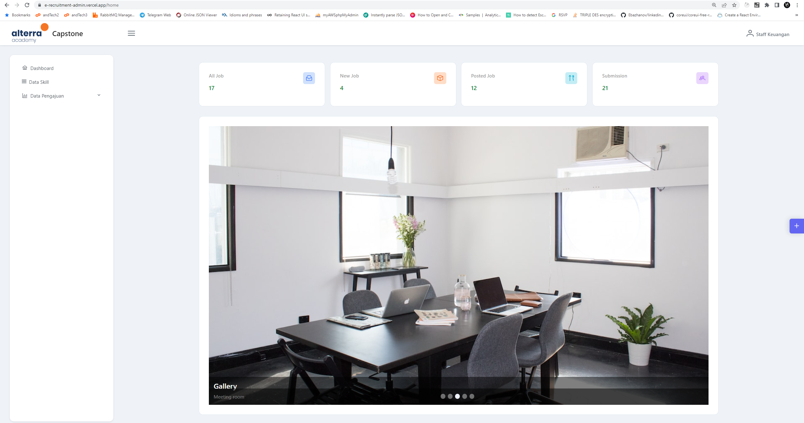
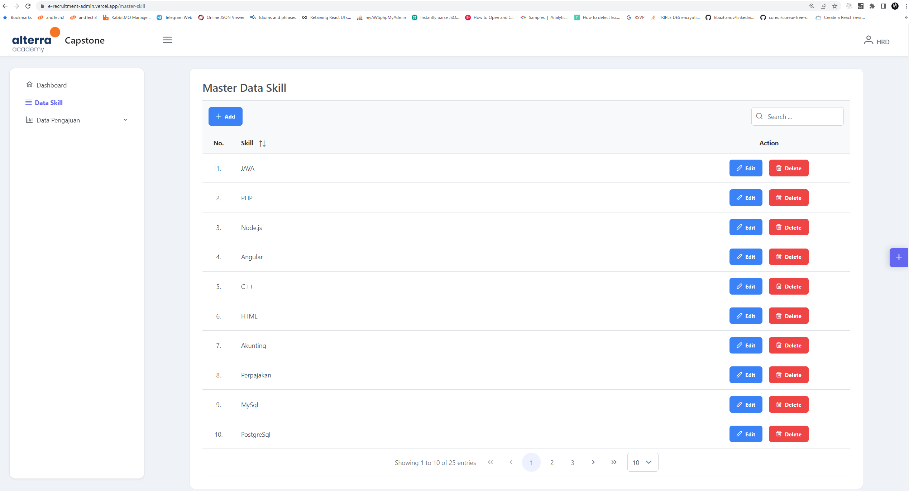
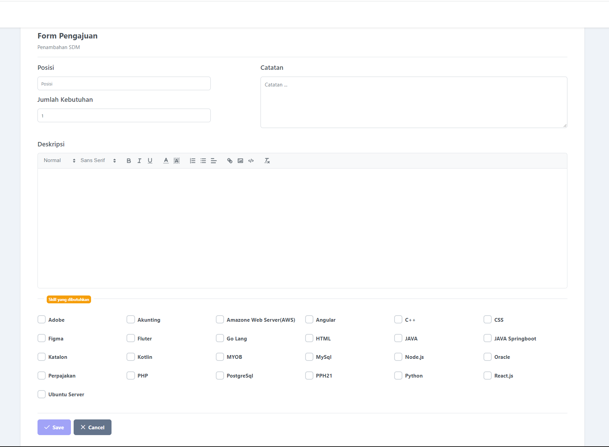
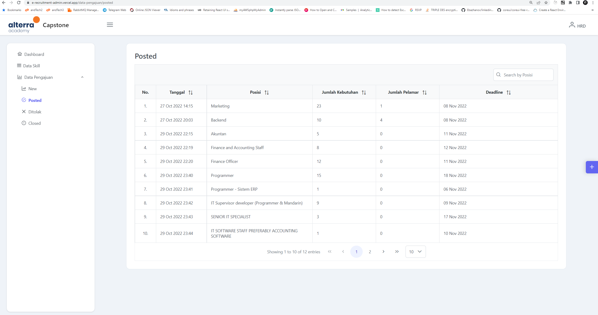
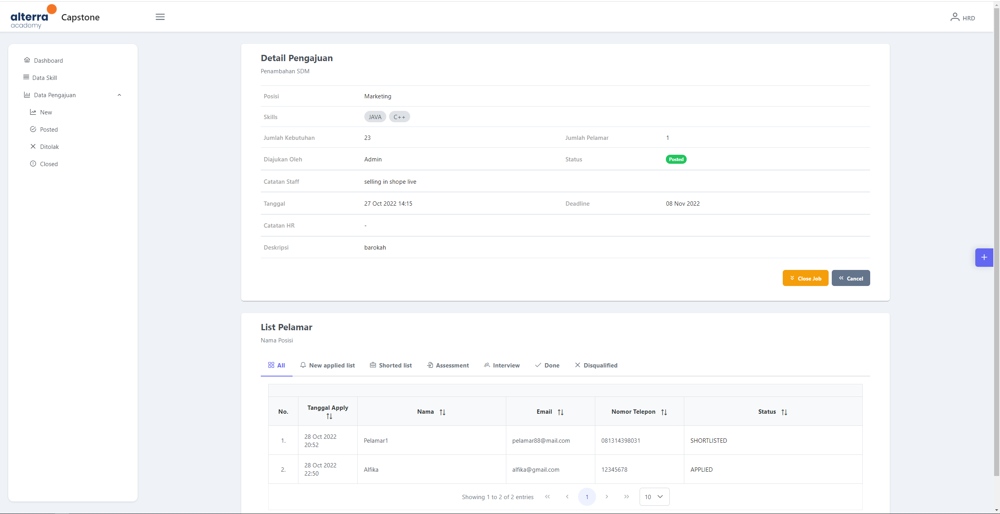

# eRecruitment

## Key Activities

### **User Bagian**

1. Mengajukan Permintaan Penambahan SDM.
2. Memantau progres/realisasi atas permintaan yang diajukan.

### **User Recruitment**

1. Memasang loker berdasarkan permintaan Penambahan SDM sesuai dengan jabatan dan kriteria yang dibutuhkan
2. Secara otomatis, dari lamaran yang masuk akan membentuk daftar prioritas kandidat berdasarkan perbandingan
   antara kriteria yang dibutuhkan terhadap data diri kandidat.
3. Psikotest dan Wawancara adalah dua kegiatan yang tidak saling terkait dan tidak berurutan, bisa dilakukan keduanya,
   bisa hanya salah satu saja.
4. Mengelola hasil psikotes dan/atau wawancara.
5. Memberi informasi via email/via situs loker kepada kandidat terkait hasil wawancara, diterima atau tidak.

### **Pelamar**

1. Signup ke situs Loker.
2. Mengajukan lamaran ke posisi/jabatan yang diinginkan dan memasukkan data diri serta data lain yang dibutuhkan. 
3. Menerima informasi hasil lulus ata tidaknya dalam proses test.

## Arsitektur & Fitur

- Angular, PrimeNG, PrimeFlex.
- Backend API on this repo : https://github.com/Yans88/eRecruitment-api.git
- Apache POI untuk import data master skill dan Export data (.xlsx)
- Pagination, server side.
- Interceptor.
- Guard.
- Web socket, notifikasi pada sisi admin dashboard ketika ada pelamar yang apply pada loker.
- Unit Testing.

## How to install on local

1. Pull this repo.
2. Install all dependecies.
3. Set endpoint API on environment
4. Run : <pre>ng serve</pre>
5. Open browser and enter this <a href="http://localhost:4200">url http://localhost:4200 </a>

## Deployment
You can access on url : https://e-recruitment-admin.vercel.app
<pre>
Login HR :
email :  hr@mail.com
password : 123456
</pre>

<pre>
Login Staff :
email :  staff1@mail.com
password : 123456
</pre>

## Preview
### Login Page

### Dashboard

### Master Data Skill

### Form Pengajuan SDM

### List Lowongan

### Monitoring Lowongan

https://github.com/orgs/alterra-sofco/repositories
